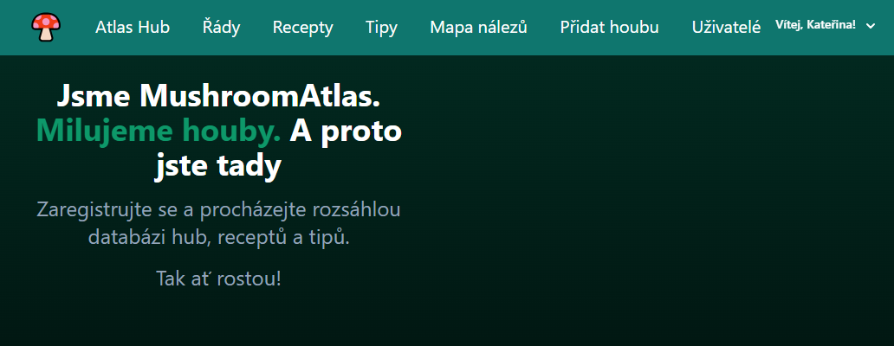

# Mushroomatlas

Mushroomatlas je ukázková webová aplikace pro houbaře, která umožňuje uživatelům sdílet a vyhledávat nálezy hub, přidávat recepty a komentáře.


## Funkce

- Registrace a přihlášení uživatelů
- Přidávání a vyhledávání nálezů hub na mapě
- Přidávání a prohlížení receptů s houbami
- Přidávání komentářů k nálezům a receptům
- Filtrování nálezů podle různých kritérií (druh houby, jedlost, aktuálnost)

## Instalace

1. Naklonujte repozitář:

```
git clone https://github.com/uzivatel/Mushroomatlas.git
cd Mushroomatlas
```

2. Vytvořte virtuální prostředí a aktivujte ho:
```
python -m venv venv
source venv/bin/activate  # Na Windows použijte `venv\\Scripts\\activate`
```
3. Nainstalujte závislosti:
```
pip install -r requirements.txt
```
4. Proveďte migrace:
```
python manage.py migrate
```
5. Spusťte vývojový server:
```
python manage.py runserver
```

## Použití
Přejděte na http://127.0.0.1:8000/ ve vašem webovém prohlížeči.
Zaregistrujte se nebo přihlaste.
Přidejte nové nálezy, recepty a komentáře.

## Struktura projektu
- Mushroomatlas/ - hlavní projektový adresář
- accounts/ - aplikace pro správu uživatelských účtů
- viewer/ - aplikace pro prohlížení a přidávání nálezů a receptů
- static/ - statické soubory (CSS, JavaScript, obrázky)
- templates/ - HTML šablony
- manage.py - skript pro správu Django projektu

## Přispívání
Pokud chcete přispět k projektu, prosím, otevřete issue nebo pull request.

## Licence
Tento projekt je licencován pod MIT licencí.